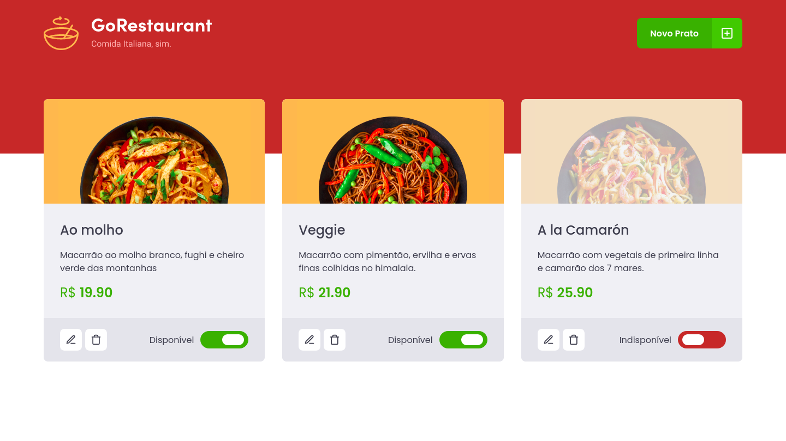

# Módulo 2 - Desafio 2

Este repositório contém a resolução do quarto desafio da trilha de ReactJS do curso Ignite.

Apresento-lhes o **GoRestaurant**, um gerenciador de menu de restaurante. O template veio totalmente pronto, como o [WatchMe](https://github.com/mluizvitor/WatchMe), desafio 2 do módulo 1. Mesmo com a aplicação pronta, tive algumas atividades a serem feitas.

Foram elas:
* Refatorar os componentes escritos como Class Components para Functional Components.
* Durante a refatoração, converter todo o código de cada componente para utilizar TypeScript.


## Iniciando a aplicação

Para iniciar, é necessário que os dois comandos abaixo executem paralelamente.

Com Yarn:

```bash
# Iniciar o servidor JSON
$ yarn server

# Iniciar aplicação
$ yarn start
```

Com NPM:

```bash
# Iniciar o servidor JSON
$ npm run server

# Iniciar aplicação
$ npm run start
```